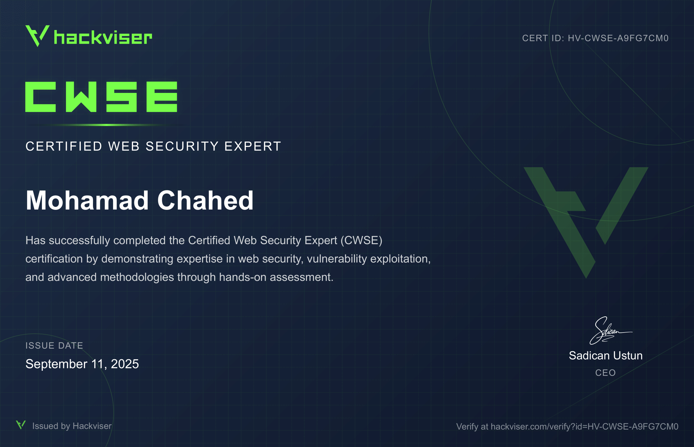
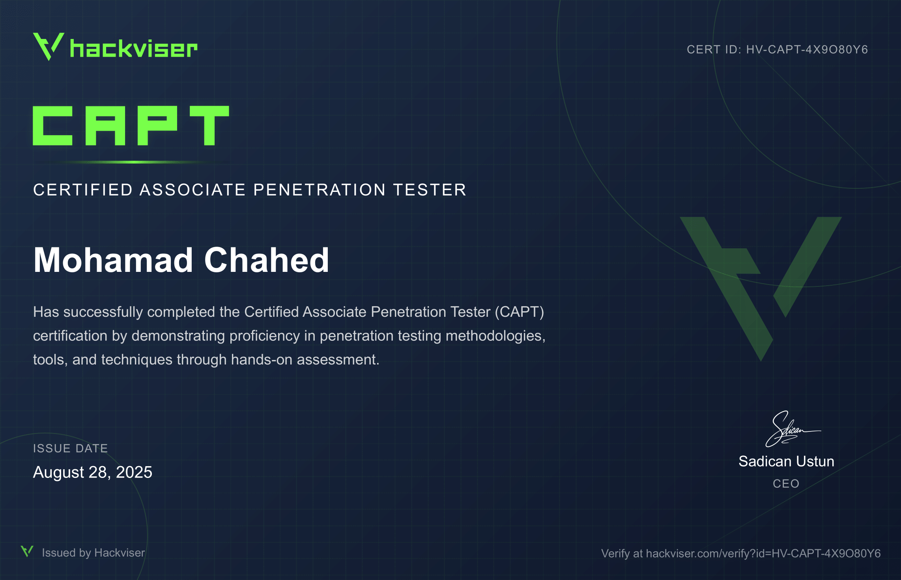

# Hi 👋, I'm Bimo

 

 

---

## About

### Cybersecurity Research
> **Focused on offensive security, Active Directory exploitation, enterprise network security, web application auditing, threat research, vulnerability analysis, and hardware exploitation.**

### Embedded Systems
> **Hardware security analysis, firmware reverse engineering, and low-level C/C++ systems engineering.**

 

---

## Featured Projects

<table width="100%">
  <tr>
    <td width="50%" valign="top">
      <h3><a href="https://github.com/Bimo754/CafeChameleon">CafeChameleon</a></h3>
      
Layer 2 captive portal security auditing framework featuring 802.11 telemetry & session analysis.

      
      
      
         
      <h3><a href="https://github.com/Bimo754/Dmap">Dmap</a></h3>
      
Lightweight multi-threaded port scanner script for fast network reconnaissance.

      
      
    </td>
    <td width="50%" valign="top">
      <h3><a href="https://github.com/Bimo754/Dshell">Dshell</a></h3>
      
Interactive reverse shell helper and payload handler built for rapid security testing.

      
      
      
         
      <h3><a href="https://github.com/Bimo754/br0kensh3ll">Br0kenSh3ll</a></h3>
      
Stealthy PHP web shell framework engineered for red team security audits.

      
      
    </td>
  </tr>
</table>

 

---

## Certifications

<table width="100%">
  <tr>
    <td width="50%" align="center" valign="top">
      
       
      <b>Certified Web Security Expert (CWSE)</b>
    </td>
    <td width="50%" align="center" valign="top">
      
       
      <b>Certified Associate Penetration Tester (CAPT)</b>
    </td>
  </tr>
</table>

